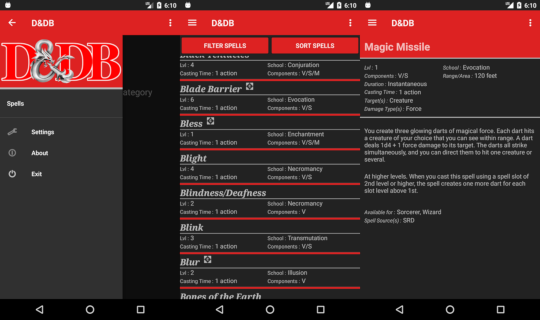
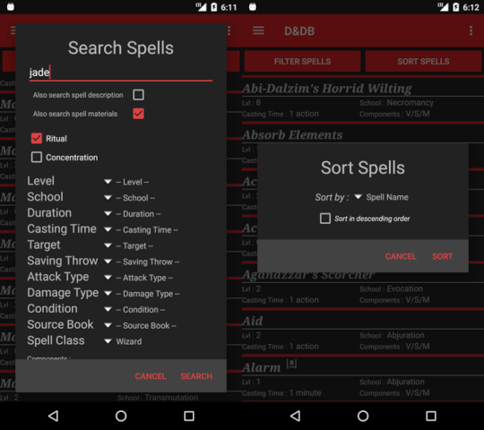

D&DB
====



Android app and database for searching and displaying data for Dungeons & Dragons (5e).

Pre-built binaries available in the [releases tab](https://github.com/dseguin/dndb/releases/latest), or download the [latest release directly](https://github.com/dseguin/dndb/releases/download/v0.1.1/dndb-androidapi19-0.1.1.apk).

Spells
------



Spells can be sorted and filtered, and selecting one shows further details. The spells included are only the ones available under the Open Game License.

More spells can be imported from `Settings->Import Source`. These source packages follow a specific format.

Source Package Format
---------------------

[An example source package can be found here](app/src/main/res/raw/srd.zip).

In order to be imported, a source package must be a zip archive with the following structure: 
```
Source.zip
  ↳ Manifest.xml
  ↳ [other files]
```

The "other files" are specified in `Manifest.xml`. The manifest file sits at the top of the folder structure and contains a list of all other files to be processed by the app. 
Here's an example `Manifest.xml`:
```xml
<?xml version="1.0" encoding="utf-8"?>
<Source>
    <ShortName>SRD</ShortName>
    <Name>Basic Rules</Name>
    <Spells>
        <AssetFile>spells_SRD_A-G.sql</AssetFile>
        <AssetFile>spells_SRD_H-P.sql</AssetFile>
        <AssetFile>spells_SRD_R-Z.sql</AssetFile>
        <AssetFile>spells_SRD_extra.sql</AssetFile>
    </Spells>
</Source>
```

At the moment, all specified asset files are processed as SQLite statements.

D&DB's Database Design
----------------------

D&DB expects SQLite DML statements for adding or updating the internal database. The current database definition [can be found here](app/src/main/res/raw/spells_ddl.sql). There are no enforced foreign keys to maintain compatibility with older versions of SQLite. Just assume that any table named `<table1>_<table2>` is a join table. An example SELECT query can be seen in the comments at the top of the [previously mentioned data definition file](app/src/main/res/raw/spells_ddl.sql).

(entity relationship diagram to be added in the future for reference)

License
-------

Source code specific to D&DB is released under the MIT License.

Data for the "Basic Rules" and other included material is provided by [Wizards of the Coast](https://dnd.wizards.com) under the [Open Game License](https://media.wizards.com/2016/downloads/DND/SRD-OGL_V5.1.pdf).

The "dragon ampersand" is part of the Dungeons & Dragons logo and [is available as a press asset from Wizards of the Coast](https://dnd.wizards.com/pressassets).

This software was developed using Google's Android Studio, which is based on IntelliJ IDEA Community Edition, and released under the Apache v2 License. The software makes use of the Android SDK, which is subject to [the Android SDK terms and conditions](https://developer.android.com/studio/terms).

Other than the base libraries provided by the Android SDK and JDK, all D&DB code is original and provided under the MIT License.
